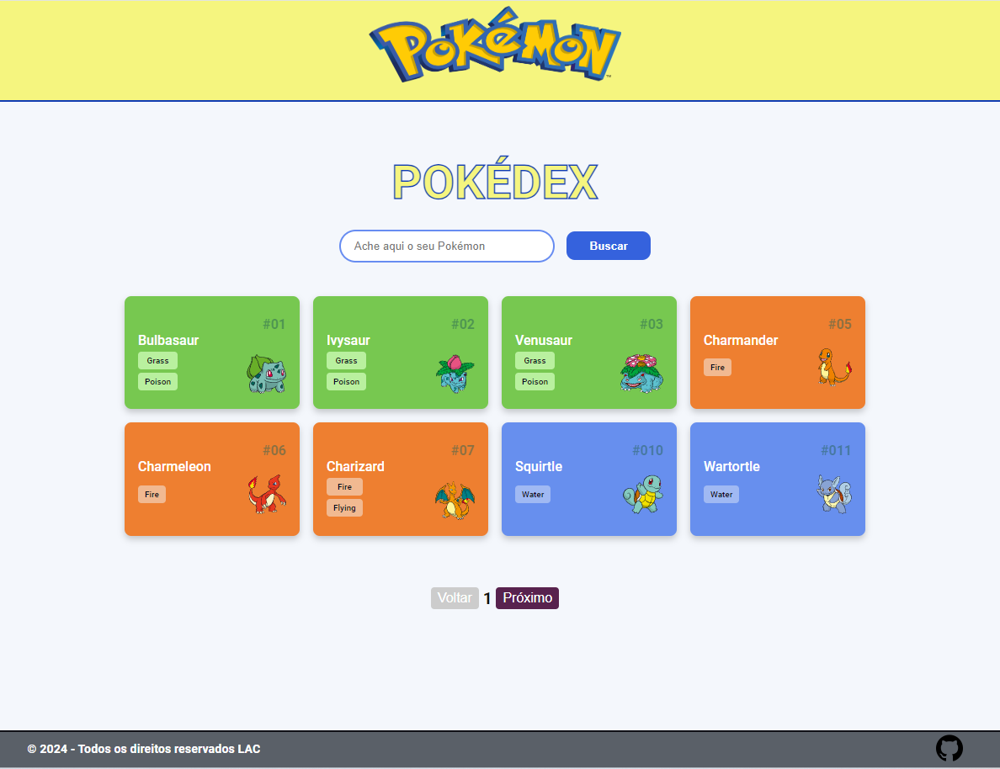
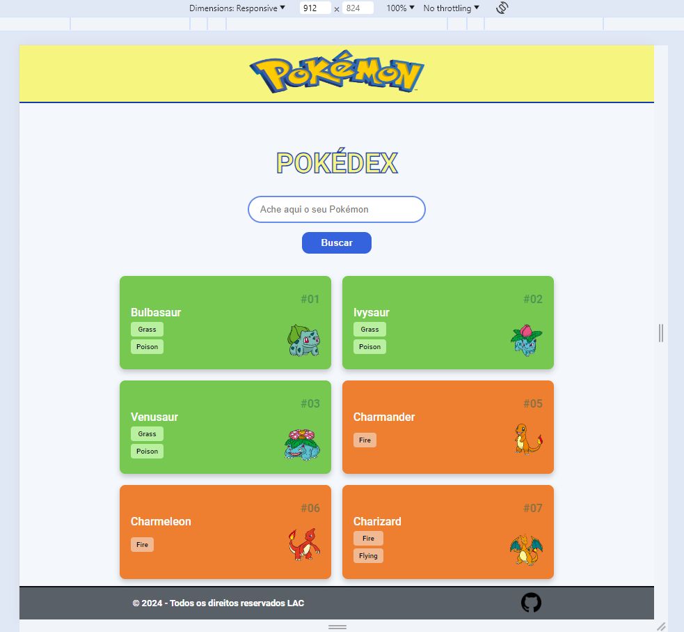
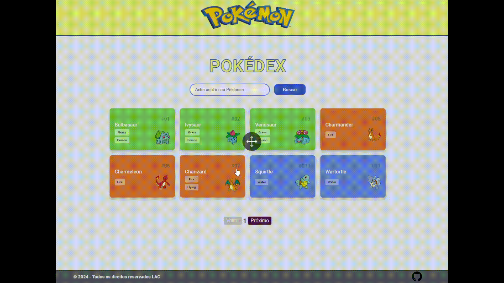

#  PROJETO POKÉDEX

Aqui você vai encontrar um pequeno projeto em HTML, CSS e JavaScript.

 

 
  
  

 

## DESCRIÇÃO DO PROJETO :computer:

Uso o JavaScript para criar uma Pokédex.

A Pokédex (palavra comum no vocabulário dos amantes de Pokémon) é uma enciclopédia virtual que detém todas as espécies de pokémon.

Para fazer a lista de Pokémons, usei a **<a href="https://pokeapi.co/api/v2/pokemon/">API</a>** de pokémons, que é grátis.

Usei a função Fetch/then para acessar a API e pegar as informaçãos dos pokémons. Também coloquei paginação.

 

 
  

 

### GIF DO PROJETO

 

 
 

 
 

:smile: **<a href="https://cellerligia-23.github.io/pokedex/">Projeto Pokédex</a>** :blush: